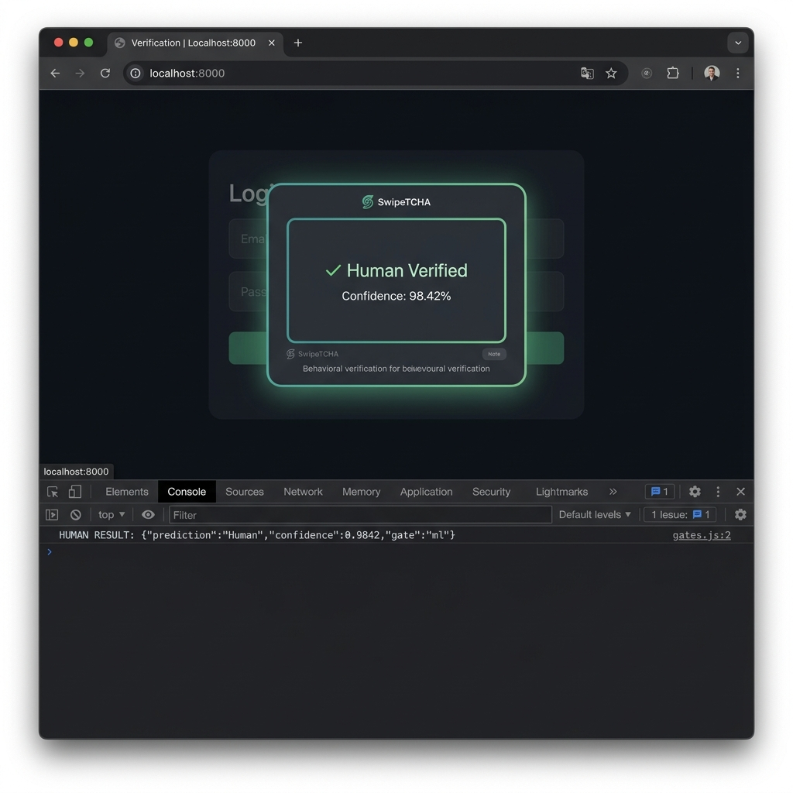
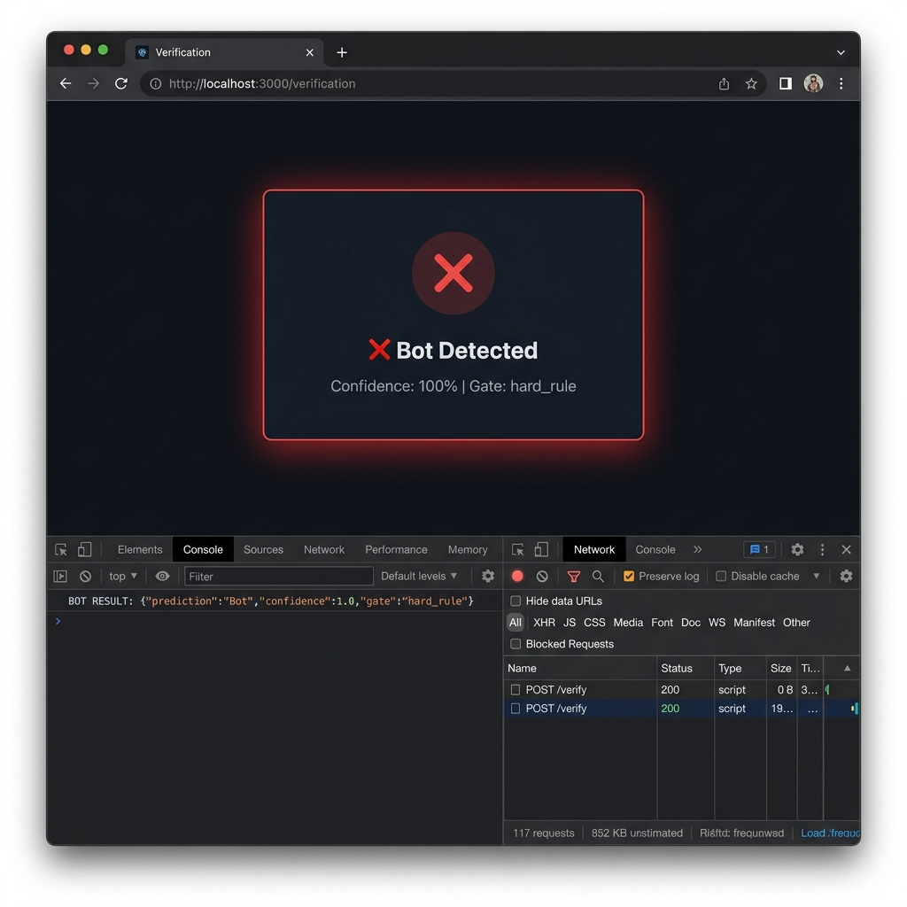
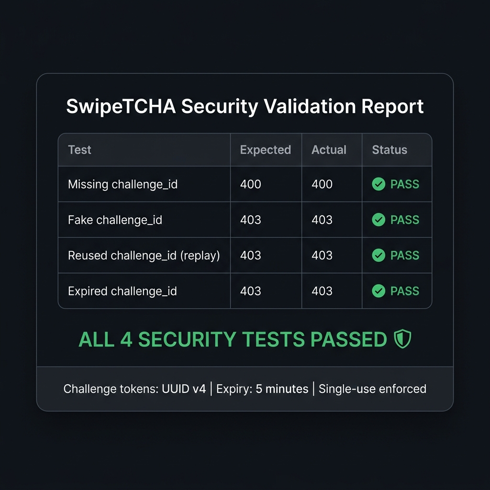
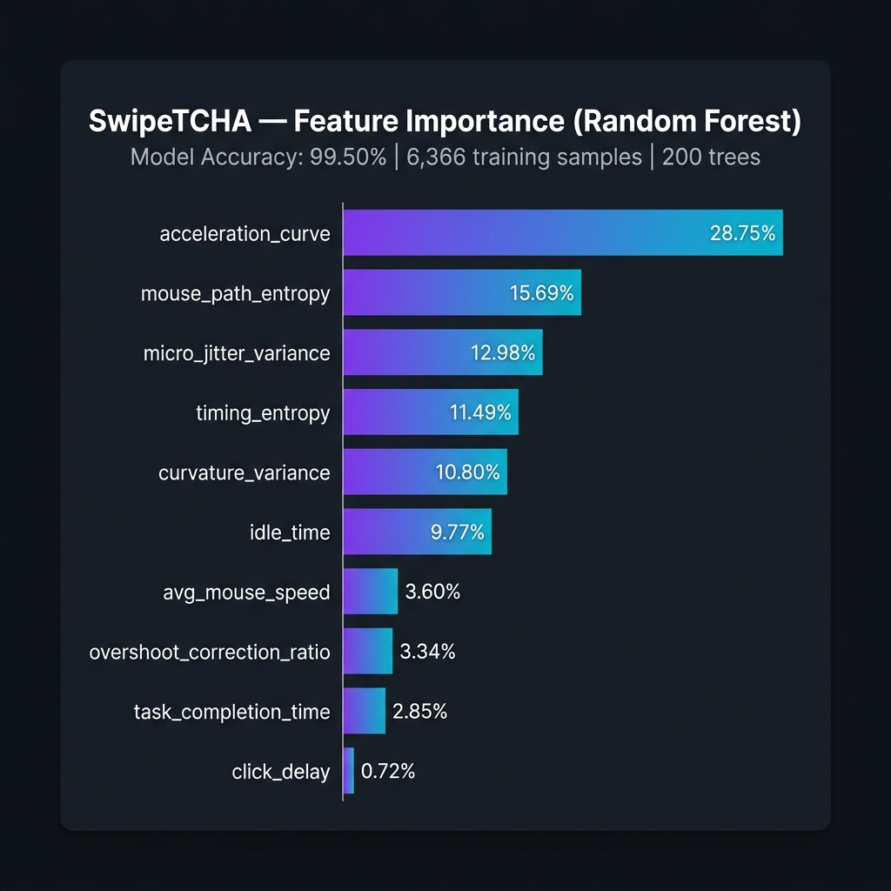

SwipeCHA (SwipeCAPTCHA)

Behavioral CAPTCHA using mouse-interaction dynamics and machine learning

SwipeCHA, also referred to in the repository as SwipeTCHA and SmartCAPTCHA, is a web-based behavioral CAPTCHA that attempts to distinguish human users from automated interactions by analyzing how a user performs a swipe, rather than asking the user to solve an image or text puzzle.

The current implementation combines:

Browser-side behavioral signal collection

Ten behavioral features

Client-side heuristic bot detection

A server-side deterministic hard-rule gate

A Random Forest classifier

Single-use, expiring challenge tokens

A FastAPI verification API

Optional Firebase/Firestore feedback collection

A standalone embeddable widget

With **Step 5: Full Integration**, the repository features a production-ready **Hindsight persistent experience memory integration** and an autonomous **Security Agent**. The classification foundation is anchored by the original supervised Random Forest model, while Hindsight retains distilled security experiences and recalls relevant historical context, enabling the Security Agent to perform contextual security assessments without modifying the core Random Forest model weights.

Table of Contents

1. Overview

2. Problem Statement

3. Solution

4. Core Concept

5. End-to-End Workflow

6. How the CAPTCHA Works

7. Behavioral Signal Collection

8. Ten ML Features

9. Security Decision Pipeline

10. Machine Learning Model

11. AI Agent and Hindsight Memory

12. Before-Memory vs After-Memory

13. Architecture

14. Detailed Data Flow

15. Frontend

16. Backend

17. Challenge-Response Security

18. Firebase Feedback System

19. Model Training Pipeline

20. Dataset

21. Model Evaluation

22. Security and Stress Testing

23. API Reference

24. Example Verification Request

25. Project Structure

26. Important Files

27. Technologies Used

28. Installation

29. Local Development

30. Retraining the Model

31. Running Validation Tests

32. Widget Integration

33. Deployment

34. Environment Configuration

35. Privacy and Security Considerations

36. Known Limitations

37. Current Implementation vs Future Work

38. Example Use Case

39. Screenshots and Demo Assets

40. Reproducibility Notes

41. Conclusion

1. Overview

Traditional CAPTCHAs generally ask users to complete an explicit challenge such as:

identifying objects in images,

entering distorted characters,

selecting particular tiles,

solving visual puzzles.

SwipeCHA takes a different approach.

Instead of primarily asking:

"Can the user solve this puzzle?"

SwipeCHA analyzes:

"How is the user interacting with the CAPTCHA?"

During a swipe interaction, the browser records pointer movement and timing information. The system derives behavioral characteristics from those events and sends a selected set of ten features to the backend.

The backend then applies multiple decision layers:

User interaction
       ↓
Behavioral feature extraction
       ↓
Client-side heuristic checks
       ↓
Challenge-token validation
       ↓
Server-side hard bot rule
       ↓
Random Forest classifier
       ↓
Human / Bot + confidence

2. Problem Statement

Automated bots can interact with web applications much faster and more consistently than humans.

Traditional CAPTCHA systems can introduce several problems:

user friction,

accessibility challenges,

repetitive puzzle solving,

dependence on visual recognition,

increasingly sophisticated automation techniques.

SwipeCHA addresses a narrower technical problem:

How can a web application use behavioral characteristics of a swipe interaction as an additional signal for distinguishing human interaction from automated interaction?

The project therefore treats the CAPTCHA interaction itself as a source of behavioral telemetry.

3. Solution

SwipeCHA presents a simple slider-style CAPTCHA.

The user interacts with the slider naturally.

While the interaction happens, the frontend records:

pointer coordinates,

timestamps,

movement direction,

movement distance,

timing gaps,

changes in speed,

path characteristics,

corrections and reversals.

These raw events are transformed into behavioral features.

The selected ten features are sent to the FastAPI backend together with a server-issued challenge ID.

The backend:

validates the challenge ID,

consumes the challenge so it cannot be reused,

checks whether the interaction matches a deterministic obvious-bot pattern,

runs the Random Forest classifier when appropriate,

calculates the highest class probability as the returned confidence,

returns the classification.

Example response:

{
  "prediction": "Human",
  "confidence": 0.9842,
  "gate": "ml"
}

4. Core Concept

The core idea is behavioral biometrics-inspired interaction analysis, but SwipeCHA should not be interpreted as a full biometric identification system.

It does not identify who the user is.

It attempts to classify the current interaction as:

Human

or:

Bot

based on behavioral characteristics of the gesture.

The system looks at properties such as:

movement speed,

directional diversity,

timing irregularity,

acceleration changes,

path curvature,

small movement variations,

backward corrections.

The model therefore receives a behavioral feature vector rather than an image.

5. End-to-End Workflow

The complete implemented flow is:

flowchart TD
    A[User opens SwipeCHA] --> B[Frontend renders slider]
    B --> C[Frontend requests challenge]
    C --> D[FastAPI /challenge]
    D --> E[Unique challenge_id]
    E --> F[Browser stores challenge_id]
    
    F --> G[User performs swipe]
    G --> H[Pointer events collected]
    H --> I[Behavioral feature extraction]
    
    I --> J[Client-side heuristic checks]
    
    J -->|Looks obviously automated| K[Reject]
    J -->|Passes client checks| L[POST /verify]
    
    L --> M[Validate challenge_id]
    M -->|Invalid / expired / reused| N[Reject HTTP 403]
    
    M -->|Valid| O[Consume challenge_id]
    O --> P[Server hard-rule gate]
    
    P -->|Naive bot pattern| Q[Bot / confidence 1.0]
    P -->|Not caught| R[Random Forest]
    
    R --> S[Prediction + probability]
    S --> T[Human / Bot + confidence]
    T --> U[Frontend displays result]

6. How the CAPTCHA Works

Step 1 — Widget initialization

The frontend creates a slider widget.

The main implementation is in:

smartcaptcha.js

The widget can also be embedded through:

widget.js

Step 2 — Challenge request

The frontend calls:

GET /challenge

The backend generates a random hexadecimal UUID:

challenge_id = uuid.uuid4().hex

The backend stores:

challenge_id → creation timestamp

in an in-memory Python dictionary.

The response is:

{
  "challenge_id": "..."
}

Step 3 — User interaction

The user drags the slider.

The frontend records pointer events.

Each event contains:

type
timestamp
x coordinate
y coordinate

For example:

{
    type: "move",
    t_ms: 12345,
    x: 182.4,
    y: 24.7
}

Step 4 — Feature extraction

After the gesture finishes, computeFeatures() processes the recorded movement events.

The implementation calculates considerably more intermediate information than the ten values ultimately transmitted to the backend.

Examples of internal calculations include:

speed statistics,

directional entropy,

timing distributions,

path deviation,

vertical movement,

direction changes,

speed coefficient of variation,

curvature,

backward movement.

Step 5 — Client-side heuristic screening

Before contacting the backend, the frontend executes:

frontendLooksBotLike(features)

This examines additional behavioral properties including:

extremely short completion time,

unusually low timing entropy,

extremely low jitter,

almost constant speed,

excessive straightness,

insufficient vertical variation,

too few direction changes,

path-shape mismatch,

overly perfect movement patterns.

This is a client-side screening layer, not the authoritative security boundary.

A malicious client can modify JavaScript, so the backend performs its own validation independently.

Step 6 — Backend verification

The frontend sends:

POST /verify

with:

the challenge ID,

the ten ML features.

The backend validates the challenge.

Step 7 — Challenge consumption

A valid challenge is removed from the dictionary:

creation_time = challenges.pop(challenge_id)

This means that the same challenge cannot successfully be submitted again.

Step 8 — Server hard-rule gate

The backend checks a deterministic bot pattern.

All six conditions must be true:

speed > 2.2
entropy < 0.08
delay < 0.2
duration < 0.8
jitter < 0.2
timing_h < 0.10

Conceptually:

Very fast
    +
Very low path entropy
    +
Almost instant interaction
    +
Very short completion time
    +
Very low jitter
    +
Very regular timing
    =
Obvious automation

If all six conditions are satisfied:

{
  "prediction": "Bot",
  "confidence": 1.0,
  "gate": "hard_rule"
}

The ML model is not executed for this case.

Step 9 — Random Forest classification

If the interaction is not caught by the hard rule, the backend constructs the feature vector in the exact training order and passes it to the trained Random Forest model.

The model returns:

prediction = model.predict(feature_vector)[0]

and class probabilities:

proba = model.predict_proba(feature_vector)[0]

The returned confidence is:

max(proba)

This is the model's highest class probability. It is not described in the implementation as a calibrated probability.

Step 10 — Result shown to the user

The frontend displays a result such as:

Verified: Human (Confidence: 98.42%)

or:

Verification failed. Bot detected (Confidence: 100.00%). Try again.

7. Behavioral Signal Collection

The main frontend implementation is:

smartcaptcha.js

The system captures pointer events while the user interacts with the slider.

The recorded session contains:

{
    widget_shown_at_ms,
    interaction_started_at_ms,
    interaction_ended_at_ms,
    events
}

Each movement event contains:

{
    type: "move",
    t_ms,
    x,
    y
}

The frontend uses performance.now() where available for timing.

It also uses a precomputed timing-noise sequence in the implementation.

8. Ten ML Features

The exact feature order is defined in both the frontend and backend:

avg_mouse_speed
mouse_path_entropy
click_delay
task_completion_time
idle_time
micro_jitter_variance
acceleration_curve
curvature_variance
overshoot_correction_ratio
timing_entropy

8.1 avg_mouse_speed

Calculated as:

total path distance / total movement time

It represents the average movement speed during the gesture.

8.2 mouse_path_entropy

The frontend:

calculates movement directions using atan2,

places directions into 12 bins,

calculates Shannon entropy,

normalizes the entropy by the maximum entropy for those bins.

Conceptually:

direction distribution
        ↓
Shannon entropy
        ↓
normalized directional entropy

This captures how varied the movement directions are.

8.3 click_delay

Calculated from:

interaction_started_at_ms - widget_shown_at_ms

and converted to seconds.

It represents the delay between widget presentation and the beginning of interaction.

8.4 task_completion_time

Calculated from:

interaction_ended_at_ms - interaction_started_at_ms

and converted to seconds.

It represents the duration of the interaction.

8.5 idle_time

Movement gaps greater than:

120 ms

are accumulated as idle time.

This captures pauses during the gesture.

8.6 micro_jitter_variance

The implementation calculates:

variance(dx) + variance(dy)

where dx and dy are movement changes between consecutive events.

This provides a measure of small movement variation.

8.7 acceleration_curve

For consecutive movement segments, the frontend calculates changes in speed over time.

Conceptually:

|Δspeed / Δtime|

The mean absolute acceleration is used as:

acceleration_curve

8.8 curvature_variance

The frontend calculates changes in movement angle and divides the angular change by segment length.

The variance of these curvature values becomes:

curvature_variance

8.9 overshoot_correction_ratio

Movement in the forward direction and movement backward are accumulated.

The feature is:

backward movement / forward movement

This captures correction or reversal behavior.

8.10 timing_entropy

Inter-event timing gaps are divided into ten bins.

The resulting distribution is converted into Shannon entropy and normalized.

This measures how regular or irregular the timing pattern is.

9. Security Decision Pipeline

SwipeCHA has multiple layers rather than relying solely on the Random Forest.

                    ┌──────────────────────────┐
                    │   User interaction       │
                    └────────────┬─────────────┘
                                 │
                                 ▼
                    ┌──────────────────────────┐
                    │ Frontend heuristics       │
                    │ additional bot signals    │
                    └────────────┬─────────────┘
                                 │
                                 ▼
                    ┌──────────────────────────┐
                    │ Challenge ID validation   │
                    └────────────┬─────────────┘
                                 │
                                 ▼
                    ┌──────────────────────────┐
                    │ Server hard-rule gate     │
                    │ obvious automation        │
                    └────────────┬─────────────┘
                                 │
                         not caught
                                 │
                                 ▼
                    ┌──────────────────────────┐
                    │ Random Forest classifier  │
                    │ 200 decision trees        │
                    └────────────┬─────────────┘
                                 │
                                 ▼
                    ┌──────────────────────────┐
                    │ Human / Bot + confidence  │
                    └──────────────────────────┘

The gate field identifies the backend decision path:

hard_rule
ml
fallback

The fallback path is used if the model file is unavailable and returns:

{
  "prediction": "Human",
  "confidence": 0.5,
  "gate": "fallback"
}

This fallback is a deployment safeguard, not a strong bot-detection mechanism.

10. Machine Learning Model

SwipeCHA uses:

RandomForestClassifier

from:

scikit-learn

The model configuration in train_model.py is:

RandomForestClassifier(
    n_estimators=200,
    max_depth=10,
    min_samples_split=4,
    min_samples_leaf=2,
    class_weight="balanced",
    random_state=42,
    n_jobs=-1,
)

Therefore:

Parameter

Value

Algorithm

Random Forest

Trees

200

Maximum depth

10

Minimum samples split

4

Minimum samples leaf

2

Class weighting

Balanced

Random seed

42

The trained model is stored as:

smartcaptcha/backend/captcha_model.pkl

The model is loaded by the FastAPI application using joblib.

11. AI Agent and Hindsight Memory

Implementation status: STEP 5 FULL INTEGRATION COMPLETE

SwipeCHA features full integration of **Hindsight persistent experience memory** and an autonomous **Security Agent**, built cleanly on top of the original supervised Random Forest model.

Architectural Division of Responsibilities:
- **Random Forest Classifier (Primary Signal):** Evaluates live 10-feature kinetic vectors to output `Human` or `Bot` classification with confidence probability. The model weights are preserved.
- **Hindsight Memory Service (`hindsight_memory.py`):** Uses the official `hindsight-client` Python SDK (v0.10.1) to retain distilled security experiences after verification and recall relevant prior experiences using dynamic semantic queries before evaluation.
- **Security Agent (`security_agent.py`):** Consumes live ML outputs, hard-rule gate statuses, live behavioral telemetry, and recalled prior security experiences to produce a structured contextual security assessment (risk level, historical context, reason codes, recommended action).
- **Decision Policy (`decision_policy.py`):** Unifies ML inference and contextual assessment into a backward-compatible response preserving all existing frontend fields.
- **Memory Bank Isolation:** All retained experiences are strictly scoped using Hindsight `bank_id` identifiers, ensuring tenant/session boundaries are maintained.
- **Fail-Safe Robustness:** If Hindsight or the LLM is temporarily unavailable or times out, verification falls back seamlessly to baseline Random Forest inference with zero user interruption.

12. Before-Memory vs After-Memory

Before-Memory (Stateless Baseline):
- Each interaction was evaluated in total isolation.
- Evasive automated bots executing slow or borderline attempts could bypass detection if individual swipes skirted single-shot thresholds.
- Re-verifying legitimate users received no benefit from established historical consistency.

After-Memory (Hindsight Integrated):
- **Turn 1 (New Scope):** Interaction evaluated with zero prior history. Baseline Random Forest classification accepted (`memory_used: false`, `reason_codes: ["ZERO_HISTORY_BASELINE"]`). Experience is distilled and retained in Hindsight.
- **Subsequent Turns:** When the user swipes again, Hindsight semantically recalls prior interactions.
  - *Human Pattern:* Consistent kinetic tremor and timing entropy reinforce human confidence (`HISTORICAL_HUMAN_CONSISTENCY`).
  - *Bot Evasion Pattern:* Prior bot attempts in the same scope trigger evasion detection on borderline swipes, escalating risk to `medium`/`high` and recommending `challenge_again` or `block`.
- **Durable Persistence:** Experiences survive process restarts and remain accessible across application sessions.

Run the reproducible demonstration:
```powershell
python smartcaptcha/backend/demo_hindsight_loop.py
```

13. Architecture

The implemented architecture consists of several major layers.

flowchart LR
    U[User]

    subgraph Browser
        W[SwipeCHA Widget]
        C[Behavioral Event Collection]
        F[Feature Extraction]
        H[Frontend Heuristics]
    end

    subgraph Backend
        API[FastAPI]
        CH[Challenge Store]
        R[Hard Rule Gate]
        RF[Random Forest Model]
    end

    subgraph Storage
        M[Model File]
        DS[Training CSVs]
        FB[Firebase Firestore]
    end

    U --> W
    W --> C
    C --> F
    F --> H
    H --> API

    API --> CH
    API --> R
    R --> RF
    RF --> API
    API --> W

    RF --> M
    DS --> RF

    W --> FB

Firebase is separate from the CAPTCHA classification path. It is used by the feedback interface.

14. Detailed Data Flow

Challenge flow

Browser
   |
   | GET /challenge
   v
FastAPI
   |
   | generate uuid.uuid4().hex
   v
challenge dictionary
   |
   | store timestamp
   v
Browser
   |
   | receives challenge_id

Verification flow

Browser
   |
   | mouse/pointer events
   v
Session event buffer
   |
   | computeFeatures()
   v
10 ML features
   |
   | + challenge_id
   v
POST /verify
   |
   v
FastAPI
   |
   +--> challenge validation
   |
   +--> consume challenge
   |
   +--> hard bot rule
   |
   +--> Random Forest
   |
   v
JSON response
   |
   v
Browser UI

15. Frontend

The primary frontend implementation is:

smartcaptcha.js

It handles:

widget creation,

slider rendering,

pointer input,

session tracking,

feature extraction,

frontend heuristics,

challenge acquisition,

backend verification,

confidence display,

reset behavior.

The visual styling is in:

style.css

The demonstration page is:

index.html

Frontend session

The current session stores:

const session = {
    widget_shown_at_ms,
    interaction_started_at_ms,
    interaction_ended_at_ms,
    events: []
};

The browser keeps this in:

window.__smartcaptcha_session

The calculated feature vector is also exposed during runtime through:

window.__smartcaptcha_features

This makes it easier to inspect the extracted values during demonstrations and debugging.

16. Backend

The authoritative ML backend is:

smartcaptcha/backend/app.py

It uses:

FastAPI

FastAPI CORS middleware

joblib

scikit-learn model

Python standard library uuid

Python standard library time

The application defines:

app = FastAPI()

and exposes the CAPTCHA API.

17. Challenge-Response Security

The challenge system is implemented in:

smartcaptcha/backend/app.py

Challenge creation

GET /challenge

creates a random challenge ID.

The challenge is stored with a timestamp.

Expiration

Challenges older than:

300 seconds

are removed.

Therefore the implemented challenge lifetime is:

5 minutes

Single-use behavior

The verification route removes the challenge:

creation_time = challenges.pop(challenge_id)

before continuing with classification.

Therefore:

First use → accepted for processing
Second use → rejected

This provides replay protection for the challenge token.

Invalid challenge

An unknown challenge results in:

403 Forbidden

with:

{
  "detail": "Invalid or expired challenge_id"
}

Missing challenge

If no challenge ID is supplied:

400 Bad Request

with:

{
  "detail": "Missing challenge_id"
}

18. Firebase Feedback System

The repository contains an optional feedback system.

Files:

firebaseFeedback.js
feedbackModal.js

The frontend loads the Firebase JavaScript SDK dynamically.

The implementation uses Firebase:

Firebase App Compat
Firebase Firestore Compat

version:

10.7.1

The feedback system writes documents to:

feedback

The stored fields are:

{
    email,
    message,
    createdAt,
    source
}

where:

source = "smartcaptcha-feedback"

The timestamp is created using:

firebase.firestore.FieldValue.serverTimestamp()

Important separation

Firebase feedback storage is not used by the Random Forest model.

It does not:

train the CAPTCHA model,

change CAPTCHA predictions,

store behavioral features,

provide persistent CAPTCHA memory,

act as Hindsight.

It is a separate feedback mechanism.

19. Model Training Pipeline

The model training script is:

smartcaptcha/ml/train_model.py

The pipeline is:

CSV dataset
    ↓
Column validation
    ↓
Feature / label separation
    ↓
Stratified train/test split
    ↓
Random Forest training
    ↓
Held-out evaluation
    ↓
5-fold cross-validation
    ↓
Feature importance
    ↓
Model + metrics saved

Train/test split

The training script uses:

train_test_split(
    X,
    y,
    test_size=0.25,
    random_state=42,
    stratify=y
)

Therefore, the actual training code uses a 75/25 split, despite the older validation report describing the split as 80/20.

The repository's model_metrics.json was generated from the stored evaluation and reports a test set corresponding to the current 6,366-row dataset.

Cross-validation

The training script also uses:

StratifiedKFold(
    n_splits=5,
    shuffle=True,
    random_state=42
)

and evaluates:

accuracy
precision
recall
f1
roc_auc

20. Dataset

The repository contains:

smartcaptcha/ml/merged_behavior_data.csv

with:

6,366 rows

and:

10 behavioral features + label

The class distribution in the stored CSV is:

Label

Meaning

Samples

1

Human

3,306

0

Bot

3,060

Synthetic dataset

The repository also contains:

smartcaptcha/ml/synthetic_captcha_data.csv

It contains:

800 human samples
600 bot samples

for a total of:

1,400 synthetic samples

The generator is:

smartcaptcha/ml/generate_synthetic_data.py

It uses NumPy's seeded random generator:

np.random.default_rng(seed=42)

and generates behavioral distributions for human and several bot profiles:

naive
padded
sophisticated

Merged dataset

The merge script is:

smartcaptcha/ml/merge_data.py

It is designed to parse external mouse-movement datasets from Phase 1 and Phase 2 paths, convert raw movement data into the ten-feature schema, and merge those samples with the synthetic dataset.

The repository contains the resulting:

merged_behavior_data.csv

but does not contain the original external raw Phase 1/Phase 2 source directories referenced by the merge script.

Therefore, the exact original source dataset cannot be reconstructed solely from this repository.

21. Model Evaluation

The stored model evaluation is:

Metric

Held-out Test

Accuracy

99.50%

Precision

99.64%

Recall

99.40%

F1

99.52%

ROC-AUC

99.99%

Confusion matrix:

                Predicted Bot   Predicted Human
Actual Bot           762               3
Actual Human          5               822

These numbers describe the dataset and evaluation recorded in the repository. They should not be interpreted as a guaranteed real-world production accuracy.

5-fold cross-validation

The stored results are:

Metric

Mean

Std Dev

Accuracy

99.39%

0.17%

Precision

99.19%

0.12%

Recall

99.64%

0.34%

F1

99.41%

0.17%

ROC-AUC

99.98%

0.01%

Feature importance

The stored Random Forest feature importances are:

Rank

Feature

Importance

1

acceleration_curve

28.75%

2

mouse_path_entropy

15.69%

3

micro_jitter_variance

12.98%

4

timing_entropy

11.49%

5

curvature_variance

10.80%

6

idle_time

9.77%

7

avg_mouse_speed

3.60%

8

overshoot_correction_ratio

3.34%

9

task_completion_time

2.85%

10

click_delay

0.72%

These are Random Forest feature importance values, not causal measurements.

22. Security and Stress Testing

The repository includes:

reports/stress_test.py

and the recorded results:

reports/stress_results.json

The stored stress test contains:

15 human-like attempts
15 bot-like attempts

Recorded results:

Type

Attempts

Accepted

Rejected

Human-like

15

15

0

Bot-like

15

0

15

The bot profile used in this stress test is intentionally strongly bot-like and includes values designed to satisfy the deterministic hard-rule gate.

Therefore, these results demonstrate the behavior of the implemented test profiles; they are not a large-scale real-world security benchmark.

Security scenarios tested

The stored test also checks:

Missing challenge ID

Expected:

400

Result:

PASS

Fake challenge ID

Expected:

403

Result:

PASS

Reused challenge ID

Expected:

First request → 200
Second request → 403

Result:

PASS

Expired challenge ID

Expected:

403

Result:

PASS

23. API Reference

The authoritative backend is:

smartcaptcha/backend/app.py

GET /

Returns basic backend status.

Example:

{
  "status": "backend alive",
  "model_loaded": true,
  "features": [
    "avg_mouse_speed",
    "mouse_path_entropy",
    "click_delay",
    "task_completion_time",
    "idle_time",
    "micro_jitter_variance",
    "acceleration_curve",
    "curvature_variance",
    "overshoot_correction_ratio",
    "timing_entropy"
  ]
}

GET /challenge

Creates a new challenge.

Example:

{
  "challenge_id": "9b1d..."
}

The challenge is stored in the backend's in-memory challenge dictionary.

POST /verify

Accepts a challenge ID and behavioral features.

Required:

challenge_id

and the ten behavioral feature fields expected by the model.

Example request:

{
  "challenge_id": "9b1d...",
  "avg_mouse_speed": 450.2,
  "mouse_path_entropy": 0.71,
  "click_delay": 0.62,
  "task_completion_time": 2.8,
  "idle_time": 0.4,
  "micro_jitter_variance": 42.7,
  "acceleration_curve": 1800.0,
  "curvature_variance": 0.031,
  "overshoot_correction_ratio": 0.08,
  "timing_entropy": 0.71
}

Possible successful response:

{
  "prediction": "Human",
  "confidence": 0.9842,
  "gate": "ml"
}

Hard-rule response:

{
  "prediction": "Bot",
  "confidence": 1.0,
  "gate": "hard_rule"
}

Fallback response:

{
  "prediction": "Human",
  "confidence": 0.5,
  "gate": "fallback"
}

24. Example Verification Request

Using JavaScript:

const challenge = await fetch(
  "http://localhost:8000/challenge"
).then(r => r.json());

const response = await fetch(
  "http://localhost:8000/verify",
  {
    method: "POST",
    headers: {
      "Content-Type": "application/json"
    },
    body: JSON.stringify({
      challenge_id: challenge.challenge_id,

      avg_mouse_speed: 450.2,
      mouse_path_entropy: 0.71,
      click_delay: 0.62,
      task_completion_time: 2.8,
      idle_time: 0.4,
      micro_jitter_variance: 42.7,
      acceleration_curve: 1800.0,
      curvature_variance: 0.031,
      overshoot_correction_ratio: 0.08,
      timing_entropy: 0.71
    })
  }
);

console.log(await response.json());

25. Project Structure

The repository contains both the current implementation and older/prototype files.

captcha-2.0-main/
│
├── README.md
├── .gitignore
├── data.csv
│
├── index.html
├── smartcaptcha.js
├── style.css
├── widget.js
├── firebaseFeedback.js
├── feedbackModal.js
│
├── backend/
│   ├── app.py
│   ├── requirements.txt
│   └── runtime.txt
│
├── reports/
│   ├── bot_rejection.png
│   ├── demo_script.md
│   ├── feature_importance_chart.png
│   ├── human_verification.png
│   ├── security_validation.png
│   ├── stress_results.json
│   ├── stress_test.py
│   └── validation_report.md
│
└── smartcaptcha/
    │
    ├── README.md
    │
    ├── backend/
    │   ├── app.py
    │   ├── captcha_model.pkl
    │   ├── requirements.txt
    │   └── runtime.txt
    │
    ├── dataset/
    │   ├── append_rows.py
    │   └── behavior_data.csv
    │
    ├── frontend/
    │   ├── index.html
    │   ├── smartcaptcha.js
    │   └── style.css
    │
    └── ml/
        ├── feature_importance.json
        ├── generate_synthetic_data.py
        ├── merge_data.py
        ├── merged_behavior_data.csv
        ├── model_metrics.json
        ├── synthetic_captcha_data.csv
        └── train_model.py

26. Important Files

File

Responsibility

index.html

Main SwipeTCHA demonstration page

smartcaptcha.js

Primary behavioral CAPTCHA implementation

widget.js

Embeddable iframe-based widget

style.css

Main widget and demo styling

firebaseFeedback.js

Firebase/Firestore feedback integration

feedbackModal.js

Feedback UI and submission logic

smartcaptcha/backend/app.py

Authoritative FastAPI + ML inference backend

smartcaptcha/backend/captcha_model.pkl

Trained Random Forest model

smartcaptcha/ml/train_model.py

Model training and evaluation

smartcaptcha/ml/generate_synthetic_data.py

Synthetic behavioral data generation

smartcaptcha/ml/merge_data.py

Raw behavioral dataset feature extraction and merging

smartcaptcha/ml/merged_behavior_data.csv

Stored training dataset

smartcaptcha/ml/model_metrics.json

Stored evaluation metrics

smartcaptcha/ml/feature_importance.json

Stored feature importance

reports/stress_test.py

Automated security/stress test

reports/stress_results.json

Recorded stress-test results

reports/validation_report.md

Validation documentation

Prototype/legacy files

The repository also contains:

backend/app.py

This is a much simpler backend that:

returns a UUID from /challenge,

always returns "Human" from /verify.

It does not contain the final ML/security implementation.

Similarly:

smartcaptcha/frontend/smartcaptcha.js

is an older implementation that collects a smaller feature set and should not be treated as equivalent to the current root-level smartcaptcha.js.

The current implementation documented by this README is:

smartcaptcha/backend/app.py
+
smartcaptcha/backend/captcha_model.pkl
+
smartcaptcha.js
+
widget.js

27. Technologies Used

Frontend

HTML5

CSS3

Vanilla JavaScript

Pointer/mouse/touch event handling

Browser Performance API

Fetch API

iframe embedding

Backend

Python 3.10.13

FastAPI

Uvicorn

FastAPI CORS middleware

Machine Learning

scikit-learn

Random Forest

pandas

NumPy

joblib

Feedback Storage

Firebase

Cloud Firestore

Firebase JavaScript SDK 10.7.1

Deployment references in the current frontend

The primary frontend JavaScript currently points to:

https://captcha-2-0-5.onrender.com/challenge
https://captcha-2-0-5.onrender.com/verify

The repository itself does not contain a Render or Vercel configuration file.

28. Installation

Requirements

The backend runtime files specify:

Python 3.10.13

Install Python 3.10.x.

Clone the repository

git clone <repository-url>
cd captcha-2.0-main

Create a virtual environment

Windows:

python -m venv .venv
.venv\Scripts\activate

Linux/macOS:

python3 -m venv .venv
source .venv/bin/activate

Install backend dependencies

The authoritative backend requirements are:

smartcaptcha/backend/requirements.txt

Install:

pip install -r smartcaptcha/backend/requirements.txt

This installs:

fastapi
uvicorn
joblib
scikit-learn
pandas

29. Local Development

Start the backend

Because the model path is:

MODEL_PATH = "captcha_model.pkl"

the backend should be started from:

smartcaptcha/backend

Run:

cd smartcaptcha/backend
uvicorn app:app --reload --port 8000

The API should then be available at:

http://localhost:8000

Test the root endpoint

Open:

http://localhost:8000/

Expected structure:

{
  "status": "backend alive",
  "model_loaded": true,
  "features": [...]
}

Run the frontend

From the repository root, serve the static files with a local HTTP server.

For example:

python -m http.server 5500

Then open:

http://localhost:5500/

Using a local server is preferable to opening the HTML file directly because the widget performs network requests and dynamically loads assets.

30. Retraining the Model

The model training script expects:

merged_behavior_data.csv

in its working directory.

Run it from:

smartcaptcha/ml

For example:

cd smartcaptcha/ml
python train_model.py

The script produces:

captcha_model.pkl
model_metrics.json
feature_importance.json

The generated model should then be placed at:

smartcaptcha/backend/captcha_model.pkl

for the backend to load it.

Training outputs

The training script calculates:

accuracy,

precision,

recall,

F1,

ROC-AUC,

confusion matrix,

5-fold cross-validation,

feature importance.

31. Running Validation Tests

The automated stress test is:

reports/stress_test.py

It expects the backend to be running on:

http://localhost:8000

Start the backend first:

cd smartcaptcha/backend
uvicorn app:app --reload --port 8000

Then, from the repository root:

python reports/stress_test.py

The script tests:

15 human-like attempts
15 bot-like attempts
missing challenge ID
fake challenge ID
reused challenge ID
expired challenge ID

The recorded output is stored in:

reports/stress_results.json

32. Widget Integration

SwipeCHA includes:

widget.js

which creates an iframe-based embeddable widget.

A host page can mount the widget through an element such as:

<div id="smartcaptcha"></div>

and load:

<script src="/widget.js"></script>

The widget dynamically loads:

style.css
smartcaptcha.js
firebaseFeedback.js
feedbackModal.js

The iframe isolates the CAPTCHA UI from the host page.

Widget verification message

The widget monitors the CAPTCHA status.

When verification succeeds, it posts a message to the parent:

SMARTCAPTCHA_VERIFIED

with a generated widget verification token.

When verification fails:

SMARTCAPTCHA_FAILED

is posted.

The current implementation's generated widget verification token is a frontend integration signal. It should not be treated as a cryptographically signed backend authorization token.

33. Deployment

The current frontend contains deployed backend URLs:

const VERIFY_ENDPOINT =
  'https://captcha-2-0-5.onrender.com/verify';

const CHALLENGE_ENDPOINT =
  'https://captcha-2-0-5.onrender.com/challenge';

Therefore, the deployed frontend communicates with the deployed FastAPI service through these endpoints.

Backend deployment requirements

The authoritative backend directory is:

smartcaptcha/backend

It contains:

app.py
requirements.txt
runtime.txt
captcha_model.pkl

The server command used by the implementation is:

uvicorn app:app --host 0.0.0.0 --port $PORT

The working directory must contain:

captcha_model.pkl

because the application loads:

MODEL_PATH = "captcha_model.pkl"

as a relative path.

Frontend deployment

The frontend is static.

The relevant files are:

index.html
smartcaptcha.js
style.css
widget.js
firebaseFeedback.js
feedbackModal.js

A static hosting service can serve these files.

The repository does not contain a framework build process.

There is no:

package.json

or frontend bundler in the supplied repository.

Therefore the frontend does not require an npm build step.

34. Environment Configuration

There are no required backend environment variables in the current implementation.

The backend does not read:

DATABASE_URL
MODEL_URL
API_KEY
SECRET_KEY

or similar environment variables.

Firebase configuration

The frontend contains a default Firebase web configuration in:

firebaseFeedback.js

It can also use:

window.__SMARTCAPTCHA_FIREBASE_CONFIG__

if a custom configuration object is supplied before the Firebase code initializes.

The Firebase web configuration is therefore frontend configuration rather than a backend secret.

Firestore security rules should still be configured appropriately in the Firebase project.

35. Privacy and Security Considerations

Implemented security controls

1. Unique challenge IDs

Each CAPTCHA session obtains a newly generated challenge ID.

2. Challenge expiration

Challenges expire after:

300 seconds

3. Single-use challenges

A successful verification consumes the challenge ID.

This prevents the same challenge from being replayed.

4. Server-side validation

The backend does not trust only the browser's decision.

The backend independently performs:

challenge validation
+
hard-rule detection
+
ML classification

5. Input validation

Feature values are converted to floats.

Invalid values can cause:

422 Unprocessable Entity

rather than being silently accepted.

6. CORS

The current backend uses:

allow_origins=["*"]
allow_methods=["*"]
allow_headers=["*"]

This is permissive and convenient for demonstrations, but it is not a restrictive production CORS policy.

Behavioral data privacy

The CAPTCHA's ten behavioral features are transmitted to the verification backend during verification.

The current implementation does not persist these feature vectors in a database.

They are used for the current verification request.

The repository's training CSV files are separate from runtime user telemetry.

Feedback privacy

The optional feedback system collects:

email
message
timestamp
source

and writes them to Firestore.

This is separate from CAPTCHA behavioral classification.

36. Known Limitations

36.1 No persistent behavioral memory

The current implementation does not remember previous interactions.

There is no:

Hindsight

integration.

There is no user-specific historical risk profile.

36.2 In-memory challenge store

Challenges are stored in:

challenges = {}

This means the challenge state exists only inside the running Python process.

Consequences include:

restart clears challenges,

multiple backend instances would not share challenge state,

horizontal scaling would require shared storage.

A production-scale architecture could use a shared store such as Redis, but that is not currently implemented.

36.3 Client-side heuristics can be bypassed

The browser executes:

frontendLooksBotLike()

Client-side code is observable and modifiable by an attacker.

Therefore it must not be treated as the primary security boundary.

The backend's challenge validation and server-side detection are more authoritative.

36.4 Hard-rule thresholds are manually selected

The backend uses fixed thresholds such as:

speed > 2.2
entropy < 0.08
delay < 0.2

These are deterministic rules rather than dynamically learned thresholds.

36.5 Model confidence is not calibrated

The backend calculates:

max(model.predict_proba(...))

and returns it as confidence.

This is a Random Forest class probability, not a separately calibrated probability estimate.

36.6 Dataset limitations

The stored model metrics are based on the repository's dataset.

The dataset includes synthetic data and merged behavioral data.

The repository does not contain the original external raw dataset referenced by merge_data.py, so complete reproduction of the original data-generation pipeline requires those external source files.

The reported metrics should therefore not be interpreted as universal real-world CAPTCHA accuracy.

36.7 Stress test limitations

The stored stress test contains:

15 human-like attempts
15 bot-like attempts

The human and bot feature profiles are generated programmatically.

This is useful for testing the implemented API pipeline, but it is not equivalent to a large-scale independent real-user evaluation.

36.8 Fallback behavior

If:

captcha_model.pkl

cannot be loaded, the backend returns:

Human
confidence 0.5
gate fallback

This should not be used as a production security configuration.

36.9 Feedback service is external

The feedback feature depends on:

Firebase
Google-hosted Firebase SDK
Firestore configuration

The CAPTCHA verification pipeline itself does not depend on Firebase.

36.10 No runtime model learning

The model is not retrained automatically from user interactions.

A new model requires an explicit training process.

There is no online learning loop.

37. Current Implementation vs Future Work

Capability

Current Status

Behavioral CAPTCHA

Implemented

Swipe interaction

Implemented

Ten behavioral ML features

Implemented

Client-side heuristics

Implemented

Server-side hard-rule gate

Implemented

Random Forest classification

Implemented

Confidence output

Implemented

Challenge-response

Implemented

Challenge expiration

Implemented

Replay protection

Implemented

Firebase feedback

Implemented

Persistent user behavioral memory

Not implemented

Hindsight integration

Not implemented

AI security agent

Not implemented

Runtime model retraining

Not implemented

Online learning

Not implemented

Distributed challenge store

Not implemented

Calibrated confidence

Not implemented

Production-scale behavioral dataset

Not established by this repository

38. Example Use Case

Consider a website protecting:

Login
Signup
Password reset
Checkout
Comment submission
API access

A site can place SwipeCHA before a sensitive action.

Human flow

User opens protected page
        ↓
SwipeCHA requests challenge
        ↓
User performs natural swipe
        ↓
Behavioral features calculated
        ↓
Challenge validated
        ↓
Hard rule passed
        ↓
Random Forest predicts Human
        ↓
Website receives successful verification

Obvious automation flow

Bot opens CAPTCHA
        ↓
Challenge issued
        ↓
Bot performs extremely fast,
regular movement
        ↓
Features calculated
        ↓
Challenge validated
        ↓
Hard-rule conditions satisfied
        ↓
Bot
        ↓
Verification rejected

Replay attempt

Valid challenge
      ↓
First verification
      ↓
Challenge consumed
      ↓
Attacker tries same challenge again
      ↓
403 Invalid or expired challenge_id

39. Screenshots and Demo Assets

The repository includes several demonstration images.

Human verification



Bot rejection



Security validation



Feature importance



These assets are useful for documentation, presentations, and hackathon demonstrations.

40. Reproducibility Notes

There are several important details when reproducing the project.

Backend working directory

Run the authoritative backend from:

smartcaptcha/backend

because the model path is relative:

MODEL_PATH = "captcha_model.pkl"

Model file

The repository includes:

captcha_model.pkl

under:

smartcaptcha/backend

The .gitignore contains:

*.pkl

which means future generated model files are ignored by Git unless explicitly handled.

Training dataset

The stored training dataset is:

smartcaptcha/ml/merged_behavior_data.csv

The training script expects that file in its current working directory.

External raw data

merge_data.py references external Windows filesystem locations for raw Phase 1 and Phase 2 mouse-movement datasets.

Those raw directories are not part of the supplied repository.

Therefore:

Existing stored model
        ≠
fully reproducible raw-data acquisition pipeline

without obtaining those source datasets separately.

Legacy documentation

The repository contains an older:

smartcaptcha/README.md

with setup instructions referring to files and paths that do not exactly match the final repository structure.

For the current implementation, this README should be treated as the authoritative documentation.

41. Conclusion

SwipeCHA is a behavioral CAPTCHA prototype that replaces traditional puzzle-oriented verification with analysis of interaction behavior.

Its implemented pipeline combines:

Simple user interaction
        ↓
Raw pointer events
        ↓
Behavioral feature extraction
        ↓
Client-side heuristic screening
        ↓
Single-use challenge validation
        ↓
Server-side deterministic bot gate
        ↓
Random Forest classification
        ↓
Human / Bot + confidence

The current system provides:

a lightweight slider CAPTCHA,

behavioral signal collection,

ten-feature ML classification,

Random Forest inference,

deterministic bot detection,

challenge expiration,

single-use challenge protection,

replay protection,

confidence reporting,

automated validation tooling,

an embeddable widget,

optional Firebase feedback collection.

The current repository does not implement Hindsight, persistent behavioral memory, an autonomous AI agent, or runtime learning from previous interactions. Consequently, previous CAPTCHA interactions do not influence later decisions beyond the temporary challenge state associated with the current request.

The architecture provides a foundation for future extensions such as persistent risk history, shared challenge storage, calibrated confidence, additional adversarial training data, and an external memory/agent layer. Those capabilities should be considered future architectural work unless and until they are implemented in the codebase.
